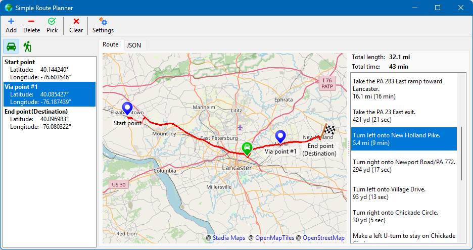

THIS REPOSITORY HAS BEEN MOVED TO https://codeberg.org/wpam/SimpleRoutePlanner

# SimpleRoutePlanner

This project calculates the travelling route between locations defined by the gps coordinates of the start and end points as well as any number of intermediate points ("via"). The route can be determined separately for cars and for pedestrians. 

## Installation
The program is available as Pascal source code only and must be compiled with Free Pascal (FPC, v3.2.0 or newer) and Lazarus (v2.0.12 or newer) for Windows, Linux (gtk2, gtk3, qt5 or qt6) or Mac OS (cocoa). A combined installation for both programs can be downloaded from https://sourceforge.net/projects/lazarus/files/. Once Lazarus and FPC are running there are no further requirements, exept for package _LazMapViewer_, version 1.0.2, which can be installed into Lazarus by means of the built-in Online-Package-Manager. 

## Usage
### API-Key
The application delegates calculation of the route to the **StadiaMaps** web server (https://stadiamaps.com/). An API-Key is required to access the server. It can be obtained by registration at https://client.stadiamaps.com/signup/. 
Note that there is a free plan for non-commercial use (https://stadiamaps.com/pricing/: _"Commercial use is defined as any usage by a company which is for-profit, or as part of a product which is sold or generates revenue."_). 
The API-Key must be entered when the application is started for the first time and will be stored in the application's ini file for subsequent use.

### SimpleRoutePlanner main window
The application's main form consists of these parts:
* _list at the left_: route definition as a list of the route locations, such as _start point_, _end point_ or intermediate _via_ points
* _map in the center_: the route is highlighted by a red polyline, and the route points are marked by symbols.
* _list at right_: route instructions telling which way to take at junctions etc. It also lists the distance and time to the next junction.
* _toolbar at the top_: commands to add/delete "via" points to the route etc.

### Setting up the map
* Zoom in or out of the map by rotating the mouse wheel.
* Hold the left mouse button down and drag the viewport so that the area of interest is visible in the map.
* These operations can be repeated and adjusted later at any time (the program must not be in "picking mode", though).
* The current map center and zoom factor are stored in the ini file so that the application opens with the same viewport as it was left.

### How to define the route
* In the left list, click on the _Start point_ entry to define that you now want to select the **start point** of the route. Click on the _Pick_ toolbutton to activate the "picking mode", then click in the map at the point where you want to begin the route. A route marker will appear with the caption "Start point", and the geo coordinates of the point are displayed in the left list below "Start point". The operation can be simplified when you double-click on the _Start point_ entry -- this automatically activate the "picking mode".
* In the same way you define the **destination** of the route (_End point_).
* Once start and end points are defined the route is calculated by the server and then drawn into the map as a red polyline.
* You can **add intermediate "via" points** through which the route should run. For this purpose, select the _End point_ of the route in the left list (or, if you already have several "via" points, the point _before_ which the new point should be inserted) and click on the _"+ Add"_ button in the toolbar. A new blank via point will be added to the list. Then proceed as already described to assign a geo location to this via point. The new route will be recalculated automatically.
* If you want to **remove a "via" point** select it in the left list and click on the _"- Delete"_ button in the toolbar. Again, the corrected route will be provided immediately.
* If you think that the position of a route point is not exactly where it should be move the mouse over the tip of the marker so that the mouse pointer changed to a "hand" cursor. Press the left mouse button and drag the point to the new location. When you release the mouse button the new route will be recalculated.

### How to follow the route
* When the route has been calculated the right list is filled with a **list of instructions** telling which way to go.
* You can click on any entry of this list, and a green marker will be displayed in the map indicating to which point of the map the selected instruction refers. If you want to see the environment of this point in more detail, move the mouse over the marker (no key pressed) and rotate the mouse wheel to zoom in.
* In the introductory screenshot, the instruction tells to _"turn left into New Holland Pike"_. The numbers _"5.4 mi (9 min)"_ refer to travelling: they mean that the next instruction will available after the specified distance and time.

